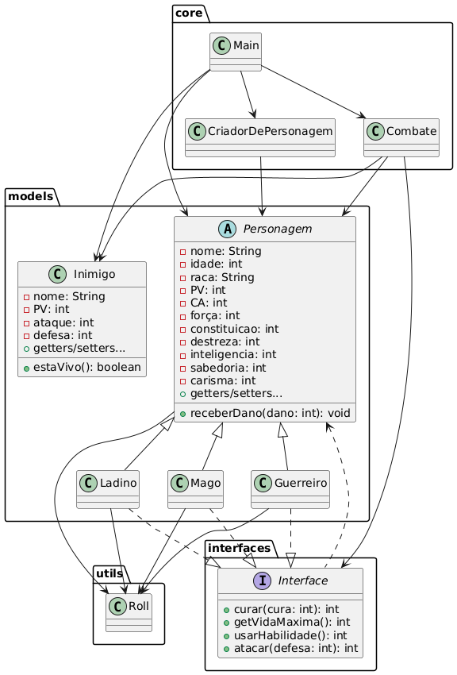

# Projeto Final - Programação Orientada a Objetos 🎲

Este repositório contém o projeto final da disciplina de **Programação Orientada a Objetos (POO)**.  
O tema escolhido foi o desenvolvimento de um **jogo de RPG**, utilizando conceitos fundamentais de POO em Java.  

---

## 📖 Sobre o Projeto

O jogo é inspirado em sistemas clássicos de RPG de mesa, onde o jogador pode criar personagens, distribuir atributos, escolher a classe, e realizar ações no console.  
Entre os conceitos de POO aplicados estão:  

- **Abstração** → com a classe abstrata `Personagem`, que define atributos e métodos comuns.  
- **Herança** → classes específicas (`Guerreiro`, `Ladino`, `Mago`) que estendem `Personagem`.  
- **Polimorfismo** → diferentes comportamentos para ataque, cura e habilidades especiais dependendo da classe.  
- **Encapsulamento** → atributos protegidos/privados com métodos de acesso (getters e setters).  
- **Interface** → a interface `Interface` define ações comuns como atacar, curar, receber dano e usar habilidades.  
- **Collections** → uso de `ArrayList` e `LinkedHashMap` para armazenar rolagens e modificadores.  

---

## 🛠️ Estrutura do Projeto

O projeto está organizado em **pacotes** para melhor modularização:  

- **`models`** → contém todas as classes de personagens e subclasses:
  - `Personagem` (abstrata)
  - `Guerreiro`
  - `Ladino`
  - `Mago`
  - `Inimigo`
- **`interfaces`** → contém a interface `Interface`, que define métodos obrigatórios para personagens.  
- **`utils`** → contém a classe `Roll`, responsável por realizar rolagens de dados (d6, d8, d10, d20) com ou sem vantagem/desvantagem.  
- **`core`** → contém:
  - `CriadorDePersonagem`: gerencia a criação do personagem com rolagem de atributos, cálculo de modificadores, distribuição de valores e escolha de classe.
  - `Combate`: gerencia o sistema de combate em turnos entre o personagem do jogador e os inimigos.
  - `Main`: ponto de entrada do programa, responsável por iniciar a criação do personagem e testar funcionalidades.  

## 📊 Diagrama UML



---

## 🚀 Como Executar

1. Clone este repositório:  
   ```bash
   git clone https://github.com/seu-usuario/nome-do-repositorio.git
   ```

2. Compile os arquivos Java (ajuste o path se necessário):  
   ```bash
   javac src/**/*.java
   ```

3. Execute o jogo:  
   ```bash
   java -cp src core.Main
   ```

---

## 📌 Funcionalidades Implementadas

- Criação e personalização de personagens:
  - Nome, idade e raça.  
  - Rolagem automática de atributos (4d6, soma dos 3 maiores, 6 vezes) com efeito de suspense (`Thread.sleep`).  
  - Distribuição dos valores pelo jogador.  
  - Cálculo automático de modificadores para cada atributo:
    - 21-20: +5
    - 19-18: +4
    - 17-16: +3
    - 15-14: +2
    - 13-12: +1
    - 11-10: 0
    - 9-8: -1
    - 7-6: -2
    - 5-4: -3
    - 3: -4
- Escolha da classe do personagem com validação:
  - Guerreiro → combate corpo a corpo, alta defesa, habilidade especial “Retomar Fôlego” (cura baseada na Constituição).  
  - Ladino → ataques furtivos e agilidade, habilidade especial “Ataque duplo” (dano baseado em Destreza).  
  - Mago → magias ofensivas poderosas, habilidade especial “Bola de Fogo” (dano baseado em Inteligência).  
- Sistema de combate baseado em rolagens de dados.  
- Controle de Pontos de Vida (PV) e Classe de Armadura (CA).  

---

## 📚 Conceitos de POO Aplicados

- **Abstração** – `Personagem` como classe abstrata, definindo atributos e métodos comuns.  
- **Encapsulamento** – atributos protegidos/privados com getters e setters.  
- **Herança** – classes específicas (`Guerreiro`, `Ladino`, `Mago`) que estendem `Personagem`.  
- **Polimorfismo** – diferentes implementações de ataque, habilidades e cura em cada classe.  
- **Interface** – `Interface` define métodos obrigatórios: atacar, curar, receber dano e usar habilidades.  
- **Collections** – uso de `ArrayList` e `LinkedHashMap` para gerenciar rolagens de dados e modificadores.  

---

## 👨‍💻 Autores

Este projeto foi desenvolvido como trabalho final da disciplina de Programação Orientada a Objetos.  

- Arthur Moreira Tenório  
- Matheus Ferreira Bezerra  

